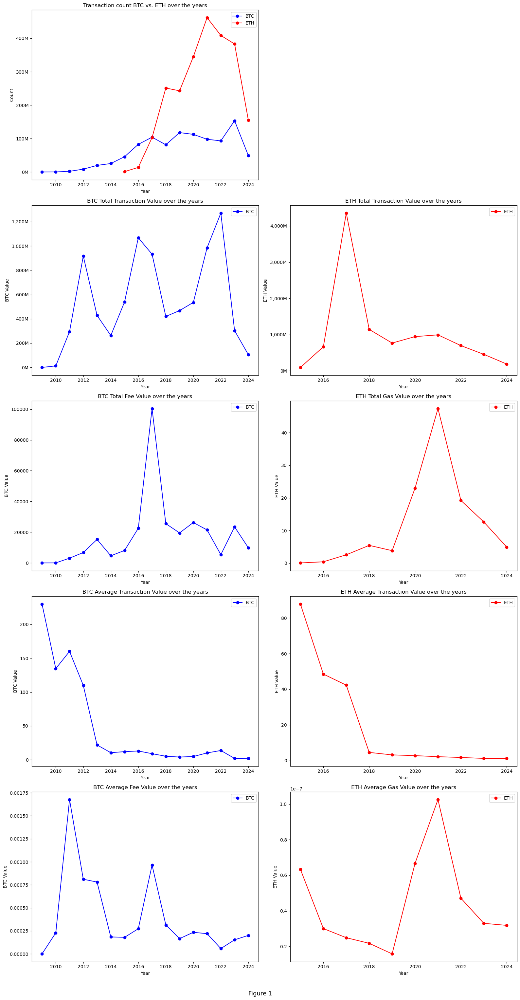
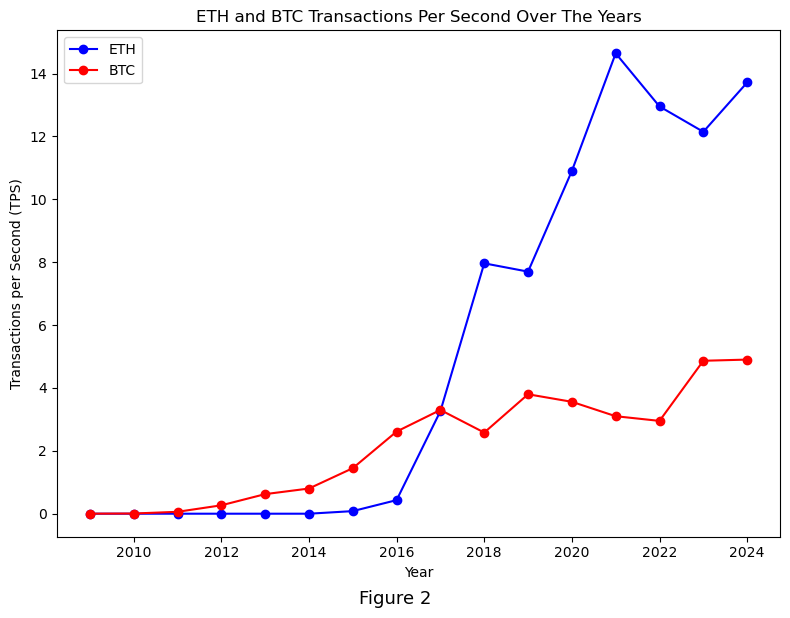
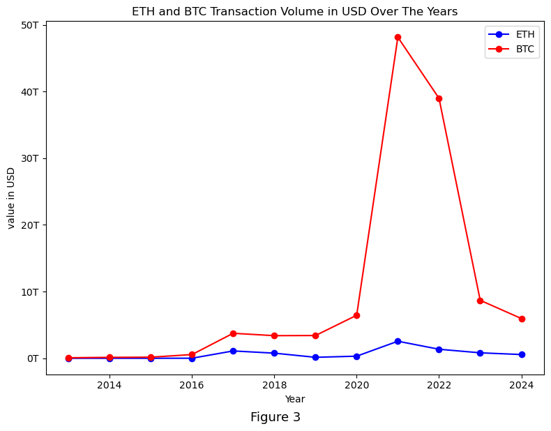
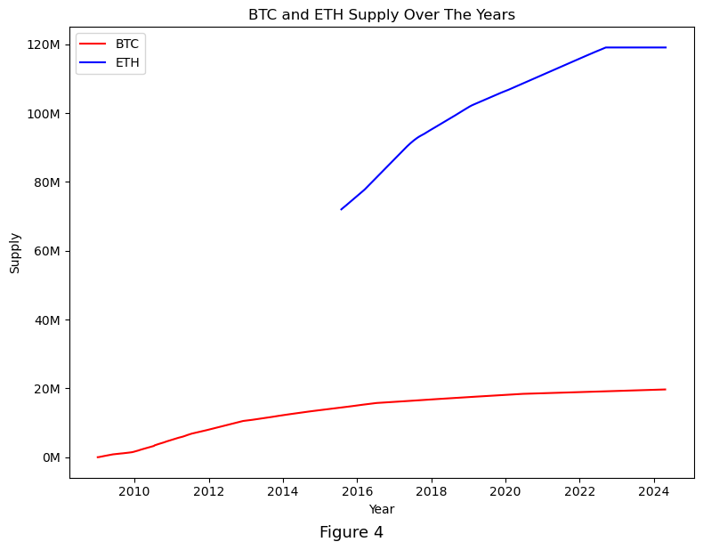
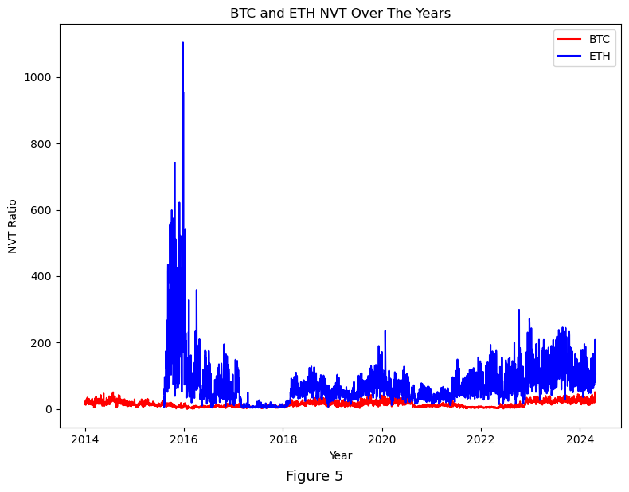

# bdcc_lab

## Which mainstream cryptocurrency is best for your needs?

- [View notebook](BDCC_Lab.ipynb)
- [Download HTML Report](BDCC_Lab.html)

## Repository contents
- `BDCC_Lab.ipynb` - main notebook
- `helper.py` - helper function to be imported in main notebook
- `sql` - folder containing `*.sql` statements
- `images` - for auxilliary images
- `crypto_prices` - eth and btc prices from Coingecko

## Visualizations

### BTC and ETH Comparisons on Count and Total and Average Value and Fees

### BTC and ETH Transactions Per Second

### BTC and ETH Transaction Volume in USD using Coingecko Historical Prices

### Total Supply of BTC and ETH Over The Years

### BTC and ETH Network Value to Transactions (NVT) Ratio
